  

  

  <!-- Profile Views -->
  

  <!-- Zenodo Downloads -->
  

  <!-- Zenodo Views -->
  

  <!-- Crates.io Downloads -->
  

<!-- 📍 Quick Navigation -->

  <a href="#status">Status</a> •
  <a href="#about">About</a> •
  <a href="#skills">What I Do Best</a> •
  <a href="#projects">Projects</a> •
  <a href="#tech-stack">Tech Stack</a> •
  <a href="#benchmarks">Benchmarks</a> •
  <a href="#writing">Writing</a> •
  <a href="#metrics">Metrics</a> •
  <a href="#connect">Connect</a>

---

## ⚡ Active Status

| Focus | Details |
|-------|---------|
| 🔭 **Currently Building** | High-throughput lock-free Rust data structures (`CL-TDS`, `PulseMap`) & Static Analyzers (`LineFault`) |
| 🛠️ **Systems Diagnostics** | Spring Boot Graph Analysis & Automated CI Gating (`WireDoctor`) |
| 🧠 **Researching** | Bio-inspired cognitive AI & zero-forgetting edge architectures (`Project Lethe`) |
| 🌱 **Learning** | RISC-V ISA design & hardware performance counters |
| 💬 **Ask Me About** | Memory orderings, false-sharing analysis, SIMD vectorization, FFM/FFI & zero-copy I/O |

---

## 👨‍💻 About Me

> **"Syntax is cheap, intuition is expensive."**

I'm a **Java and Rust developer, systems engineer, and AI researcher** from Jaipur, India, obsessed with pushing hardware to its absolute limits. I enjoy turning "impossible" optimization problems into elegant, high-performance solutions—whether it's building scalable backend systems in **Java**, writing ultra-efficient low-level code in **Rust**, or designing bio-inspired AI architectures for edge intelligence.

---

## 🔥 What I Do Best

| Category | Skills |
|----------|--------|
| **⚡ Performance Optimization** | SIMD, Cache Locking, Lock-Free Atomics, Zero-Copy I/O |
| **🦀 Systems Programming** | Rust, C++, Low-Level APIs |
| **🔬 Compiler & Static Analysis** | AST, HIR, MIR Analysis, `LateContext` Linting, Monomorphization Hazards (`LineFault`) |
| **🧠 AI & ML** | Bio-Inspired Architectures, Edge AI, Fixed-Memory Systems |
| **🌐 Web & Backend** | Rust/Axum, Java/Spring Boot |
| **🔧 Tools & DevOps** | Docker, Systemd, Windows Services, Cross-Platform Builds |

---

## 📊 GitHub Metrics

  

  
  
  

---

## 🚀 Featured Top Projects & Research (⭐)

<table width="100%">
  <tr>
    <td width="50%" align="center" valign="top">
      <h3><a href="https://github.com/ddsha441981/linefault">🦀 LineFault</a></h3>
      
<b>Rust Cache-Line & Memory Ordering Static Analyzer</b>

      

        
        
      

      

    </td>
    <td width="50%" align="center" valign="top">
      <h3><a href="https://github.com/ddsha441981/wiredoctor">🩺 WireDoctor</a></h3>
      
<b>Spring Boot Context Diagnostics & CI Gating</b>

      

        
        
      

      

    </td>
  </tr>
  <tr>
    <td width="50%" align="center" valign="top">
      <h3><a href="https://doi.org/10.5281/zenodo.20426838">🧠 Project Lethe</a></h3>
      
<b>Bio-Inspired Edge AI Continual Learning Engine</b>

      

        
        
      

      

    </td>
    <td width="50%" align="center" valign="top">
      <h3><a href="https://github.com/ddsha441981/cl-tds">⚡ CL-TDS</a></h3>
      
<b>1 MB Cache-Locked Temporal Decay Sketch</b>

      

        
        
      

      

    </td>
  </tr>
</table>

### 🛠️ Systems Libraries & Core Utilities

<table width="100%">
  <tr>
    <td width="50%" align="center" valign="top">
      <h3><a href="https://github.com/ddsha441981/pulse_map_bindings">⚡ PulseMap</a></h3>
      
<b>Fixed-Capacity Hash Map with LFU+LRU</b>

      

        
      

      

    </td>
    <td width="50%" align="center" valign="top">
      <h3><a href="https://github.com/ddsha441981/sketchboot">⚡ Sketchboot</a></h3>
      
<b>Spring Boot Rate Limiter via FFM & Rust</b>

      

        
      

      

    </td>
  </tr>
  <tr>
    <td width="50%" align="center" valign="top">
      <h3><a href="https://github.com/ddsha441981/struct-mapper">⚡ Struct Mapper</a></h3>
      
<b>Zero-Boilerplate Rust Struct Derive</b>

      

        
      

      

    </td>
    <td width="50%" align="center" valign="top">
      <h3><a href="https://github.com/ddsha441981/voxora">🎙️ Voxora Service</a></h3>
      
<b>Audio Capture & Keyring Daemon</b>

      

        
      

      

    </td>
  </tr>
  <tr>
    <td width="50%" align="center" valign="top">
      <h3><a href="https://github.com/ddsha441981/GodseYe">👁️ GodseYe</a></h3>
      
<b>Tauri 2.0 DWM Stealth & VAD Engine</b>

      

        
        
      

      

    </td>
    <td width="50%" align="center" valign="top">
      <h3><a href="https://github.com/ddsha441981/MAGNETIC-MATH-UNIVERSE">🧲 Math Universe</a></h3>
      
<b>Esoteric Hardware Computation</b>

      

        
      

      

    </td>
  </tr>
</table>

---

## 🛠️ Skills & Technical Stack

<table width="100%">
  <tr>
    <td width="50%" align="center" valign="top">
      <h3>🦀 Low-Level & Systems</h3>
      <table align="center">
        <tr>
          <td align="center"> <b>Rust</b></td>
          <td align="center"> <b>C++</b></td>
          <td align="center"> <b>Zig</b></td>
        </tr>
      </table>
    </td>
    <td width="50%" align="center" valign="top">
      <h3>☕ High-Level & Backend</h3>
      <table align="center">
        <tr>
          <td align="center"> <b>Java</b></td>
          <td align="center"> <b>JavaScript</b></td>
          <td align="center"> <b>TypeScript</b></td>
        </tr>
      </table>
    </td>
  </tr>
  <tr>
    <td width="50%" align="center" valign="top">
      <h3>⚡ Frameworks & Tools</h3>
      <table align="center">
        <tr>
          <td align="center"> <b>Spring Boot</b></td>
          <td align="center"> <b>Struts</b></td>
          <td align="center"> <b>Servlet</b></td>
          <td align="center"> <b>Tauri</b></td>
        </tr>
      </table>
    </td>
    <td width="50%" align="center" valign="top">
      <h3>💻 Operating Systems</h3>
      <table align="center">
        <tr>
          <td align="center"> <b>Linux</b></td>
          <td align="center"> <b>Ubuntu</b></td>
          <td align="center"> <b>Kali</b></td>
          <td align="center"> <b>Windows</b></td>
          <td align="center"> <b>macOS</b></td>
        </tr>
      </table>
    </td>
  </tr>
  <tr>
    <td width="50%" align="center" valign="top">
      <h3>🎨 Frontend Dev</h3>
      <table align="center">
        <tr>
          <td align="center"> <b>HTML5</b></td>
          <td align="center"> <b>CSS3</b></td>
          <td align="center"> <b>JavaScript</b></td>
          <td align="center"> <b>TypeScript</b></td>
          <td align="center"> <b>React</b></td>
        </tr>
      </table>
    </td>
    <td width="50%" align="center" valign="top">
      <h3>🔧 DevOps & CI/CD</h3>
      <table align="center">
        <tr>
          <td align="center"> <b>Docker</b></td>
          <td align="center"> <b>Git</b></td>
          <td align="center"> <b>Actions</b></td>
          <td align="center"> <b>Bash</b></td>
        </tr>
      </table>
    </td>
  </tr>
</table>

### ⚡ Systems Optimization Benchmarks
| Optimization | What I Do With It | Target Metric |
|--------------|--------------------|---------------|
| **Static Cache Analysis** | Detect cache-line false sharing & memory ordering bugs (LineFault) | `0 Compiler ICEs` |
| **CI Diagnostic Gating** | Tarjan SCC dependency graph analysis & context validation (WireDoctor) | `Zero Cyclic Deadlocks` |
| **SIMD Vectorization** | Parallelize memory ops via AVX-512 | `>100M Ops/sec` |
| **Cache Locking** | Keep data entirely in L3 Cache (1MB max) | `Zero Cache Misses` |
| **Lock-Free Atomics** | Zero-mutex concurrent data structures | `0 Lock Contention` |
| **FFM / FFI** | Native Rust bindings for Java 22 / Node.js | `<1.2ns Overhead` |
| **Bio-Inspired Memory** | Selective memory decay algorithm (Project Lethe) | `4M Vectors/sec CPU` |

<table width="100%">
  <tr>
    <td style="background-color:#1e1e1e; border:1px solid #333333; border-radius:6px; padding:0px;">
      

        <b>Terminal — ddsha441981@ddsha441981-Latitude-7490</b>
      

      

        ddsha441981@ddsha441981-Latitude-7490:~$ systems-suite-verify --all-projects --release 
        [INFO] [Project Lethe] Bio-Inspired Edge AI: 4.07M vectors/sec (O(1) Welford EMA) ... OK 
        [INFO] [LineFault] MIR Static Analysis & False-Sharing Hazard Checker ... OK 
        [INFO] [WireDoctor] Spring Boot Diagnostics & Tarjan SCC CI Gate Engine ... OK 
        [INFO] [CL-TDS] 1MB L3 Cache-Locked Sketch (100M+ ops/sec, 0 Lock Contention) ... OK 
        [INFO] [GodseYe] 5-Layer DWM Display Affinity & Zero-Copy Audio VAD Loop ... OK 
        [SUMMARY] Executing 10-Project Portfolio Validation Suite: 
        &nbsp;&nbsp;├── Memory Footprint : Strictly Bounded O(1) Memory Models 
        &nbsp;&nbsp;├── Mutex Contention : 0 (Lock-Free Atomics & Zero-Copy Pipelines) 
        &nbsp;&nbsp;├── Interop Overhead : 1.2ns (Java 22 FFM / Win32 FFI Bindings) 
        &nbsp;&nbsp;└── System Status &nbsp;&nbsp;&nbsp;: ⚡ ALL 10 PROJECTS VERIFIED & OPERATIONAL 
        ddsha441981@ddsha441981-Latitude-7490:~$ _
      

    </td>
  </tr>
</table>

---

## 📈 GitHub Metrics & Ecosystem

  

### 🐍 Contribution Eating Snake

  

---

## 📰 Latest Writing & Technical Articles

<!-- BLOG-POST-LIST:START -->
* 🦀 [Building Lock-Free 1MB Data Structures in Rust](https://dev.to/ddsha441981)
* 🧠 [Bio-Inspired AI Memory Architectures: Pushing 4M Vectors/sec on CPU](https://medium.com/@ddsha441981)
* ⚡ [Java 22 FFM API & Foreign Function Interoperability with Rust](https://dev.to/ddsha441981)
<!-- BLOG-POST-LIST:END -->

---

## 📫 Connect With Me

  
  
  
  
  
  
  
  

---

## 🌟 Fun Facts About Me
1. I once built a hash map that fits **entirely in L3 cache** (1MB)!
2. My favorite optimization rule: **"If you don't need it, don't store it."**
3. I have a secret dream of building a custom RISC-V CPU for streaming data processing.

---

  <i>
    "The best code is the one that the hardware loves." ✨ 
    — Deendayal Kumawat
  </i>

---

  <i>Sponsoring supports independent research in bio-inspired AI architectures (Project Lethe) and zero-dependency high-throughput Rust crates.</i>  
  

---

