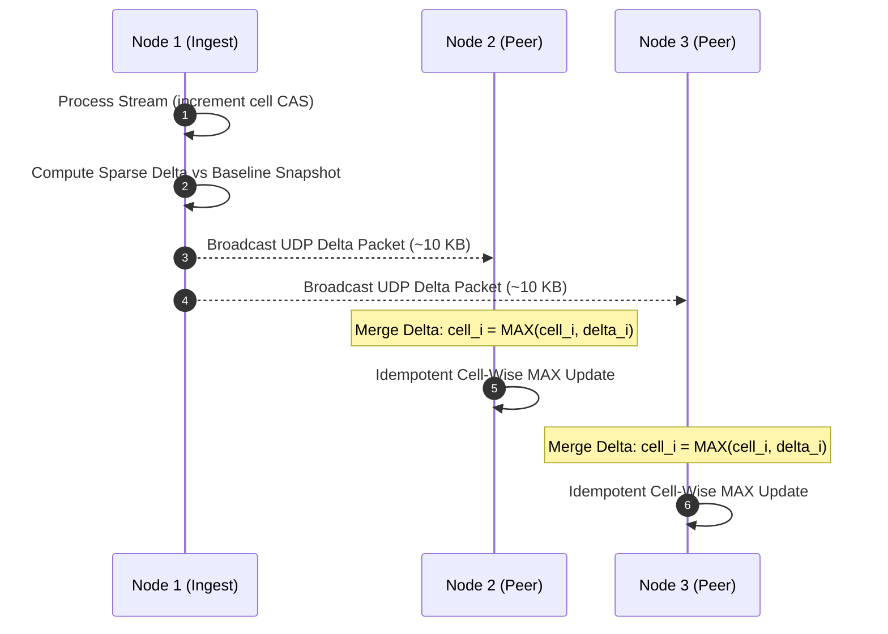

# ⚡ CL-TDS — Cache-Locked Temporal Decay Sketch

> **Lock-Free, 1 MB Fixed-Memory Streaming Heavy-Hitter Detection Engine in Pure Rust**

[](LICENSE)
[](https://crates.io/crates/cl-tds)
[](#)
[](#)

CL-TDS (Cache-Locked Temporal Decay Sketch) is a zero-dependency Rust library designed for real-time heavy-hitter and frequency tracking across continuous data streams. By locking its matrix structure to exactly 1 MB, CL-TDS guarantees that all operations execute within CPU L3 cache without heap allocations or mutex locks.

---

## 🧠 Memory Efficiency & Throughput Comparison

### Memory Footprint vs HashMap

| Unique Items Processed | Standard HashMap | CL-TDS | Memory Advantage |
|---|---|---|---|
| **100,000** | 1.9 MB | **1.0 MB** | 1.9x smaller |
| **1,000,000** | 29.8 MB | **1.0 MB** | 29.8x smaller |
| **5,000,000** | 119.0 MB | **1.0 MB** | 119x smaller |
| **10,000,000** | 238.0 MB | **1.0 MB** | **238x smaller** |

### Benchmark Execution Speed

| Operation | CL-TDS (1 MB) | Standard HashMap | Performance Delta |
|---|---|---|---|
| **Insert (1M Items)** | **26.1M Ops/sec** | 14.9M Ops/sec | **+75% throughput** |
| **Query (1M Items)** | **49.4M Ops/sec** | 10.4M Ops/sec | **+375% throughput** |
| **Multi-Thread (4 Cores)** | **43.4M Ops/sec** | Contention / Lock-bound | **Lock-Free Atomic CAS** |

---

## 🔬 Algorithmic Mechanics

```
┌─────────────────────────────────────────────────────────┐
│  4 Rows × 65,536 Columns × 4 Bytes = 1,048,576 Bytes    │
│                                                         │
│  Row 0: [ 8-bit TS | 24-bit Count ] ... (65,536 cells)  │
│  Row 1: [ 8-bit TS | 24-bit Count ] ... (65,536 cells)  │
│  Row 2: [ 8-bit TS | 24-bit Count ] ... (65,536 cells)  │
│  Row 3: [ 8-bit TS | 24-bit Count ] ... (65,536 cells)  │
│                                                         │
│  • Lock-free Atomic CAS operations                      │
│  • Lazy temporal decay (right-shift counter on touch)   │
└─────────────────────────────────────────────────────────┘
```

1. **Cell Packing**: Each 32-bit cell packs an **8-bit epoch timestamp** and a **24-bit frequency counter**.
2. **Lazy Temporal Decay**: On element access, stale counters are right-shifted according to elapsed epoch deltas ($V_{\text{lazy}} = V_{\text{full}}$).
3. **Provable Error Bounds**:
   - Error Bound: $E[\text{query}(x)] \le f(x) + \varepsilon \cdot N_{\text{effective}}$ ($\varepsilon = e/65536 \approx 0.0000414$)
   - False Positive Probability: $P[\text{false positive}] \le \delta$ ($\delta = e^{-4} \approx 1.8\%$)

---

## 🌐 Distributed Multi-Node Sync via Idempotent Gossip

Nodes synchronize state without central coordinators or database dependencies:
- **Shared Seed Initialization**: `ClTds::with_fixed_seed(seed, epoch_ms)` enforces matching hashing functions across nodes.
- **Cell-Wise MAX Merge**: Gossip packets merge incoming matrices using idempotent `MAX(cell_a, cell_b)` logic to prevent overcounting across multi-path gossip routes.
- **Sparse Delta Encoding**: `compute_delta_from_bytes()` reduces network payload bandwidth by **10x–100x**.

### ⚡ Gossip State Replication Flow



---

## 💻 Rust Usage Example

```rust
use cl_tds::ClTds;

// Create 1 MB sketch with 1-second auto-decay epoch
let sketch = ClTds::with_epoch_interval(1000);

// Record stream occurrences (Lock-Free)
sketch.increment(0xDEAD_BEEF);
sketch.increment(0xDEAD_BEEF);

// Query estimated frequency
let count = sketch.query(0xDEAD_BEEF);
println!("Estimated frequency: {}", count);
```

---

## 📜 License

Licensed under the Apache License, Version 2.0.
