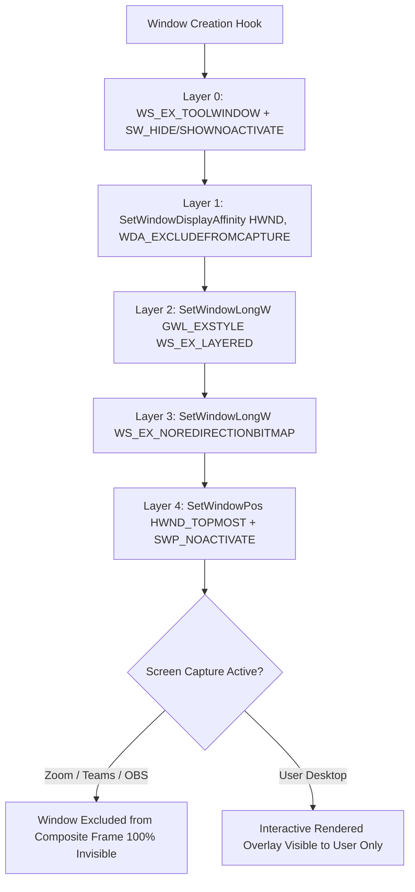

# 👁️ GodseYe — Tauri-Based Stealth AI Voice Assistant & Desktop Window Affinity Engine

> **Cross-Platform Tauri 2.0 / Rust Desktop Assistant with 5-Layer DWM Screen Capture Exclusion & Real-Time Audio VAD**

[](https://tauri.app)
[](https://www.rust-lang.org)
[](https://reactjs.org)
[](LICENSE)

GodseYe is a desktop application constructed on Tauri 2.0 and Rust that integrates low-level Windows Desktop Window Manager (DWM) display affinity APIs with a multi-language voice transcription pipeline and multi-LLM orchestrator.

---

## 🔬 Systems Architecture & 5-Layer Stealth Engine

To protect window overlays from screen capture APIs (Zoom, Teams, OBS, Windows Game Bar), GodseYe applies a 5-layer DWM display affinity pipeline via win32 FFI bindings:

```
┌─────────────────────────────────────────────────────────────────────────────┐
│                    5-LAYER DWM DISPLAY AFFINITY PIPELINE                    │
├─────────────────────────────────────────────────────────────────────────────┤
│  Layer 0: WS_EX_TOOLWINDOW + SW_SHOWNOACTIVATE                              │
│           (Alt+Tab & Taskbar Removal)                                       │
│  Layer 1: SetWindowDisplayAffinity(hwnd, WDA_EXCLUDEFROMCAPTURE)             │
│           (Direct DWM Frame Exclusion from Capture APIs)                    │
│  Layer 2: WS_EX_LAYERED + SetLayeredWindowAttributes(hwnd, 0, 255, LWA_ALPHA) │
│           (Alpha Blending Protection Layer)                                 │
│  Layer 3: WS_EX_NOREDIRECTIONBITMAP + SetWindowPos(SWP_FRAMECHANGED)        │
│           (Bypasses Composition Redirection Bitmaps)                        │
│  Layer 4: HWND_TOPMOST + WS_EX_NOACTIVATE                                   │
│           (Top-most Display Order without Stealing Focus)                   │
└─────────────────────────────────────────────────────────────────────────────┘
```

### ⚡ 5-Layer DWM Stealth Hook Sequence



---

## 🎙️ Dual-Language Audio & VAD Pipeline

```
┌─────────────────┐  16kHz PCM  ┌────────────────────────┐  RMS Energy VAD  ┌───────────────────────────┐
│ SpeakerCapture  │ ──────────> │ VAD Engine (Rust)      │ ───────────────> │ Go WebSocket Audio Server │
│ Native Binary   │             │ threshold: 0.008 RMS   │                  │ Port 8085 (EN) / 8086 (HI)│
└─────────────────┘             └────────────────────────┘                  └─────────────┬─────────────┘
                                                                                          │ Transcript
                                                                                          ▼
┌─────────────────────────────────────────────────────────────────────────────────────────────────────────┐
│ Multi-LLM Provider Manager (Rust Async Tokio Runtime)                                                   │
│ • OpenAI / Claude / Gemini / Groq / OpenRouter Fallback Chains                                           │
│ • Tantivy In-Memory Vector / RAG Search Engine Integration                                             │
└─────────────────────────────────────────────────────────────────────────────────────────────────────────┘
```

- **Zero-Copy VAD Filtering**: Root-Mean-Square (RMS) chunk evaluation filters ~70% silent PCM frames before sending to local transcription daemons.
- **WebSocket IPC Routing**: Separate dual-process audio servers (`go-server-en` at port 8085 and `go-server-hi` at port 8086) process streaming 16-bit PCM arrays.

---

## 🛠️ Technical Stack & Dependencies

| Subsystem | Technology | Functional Scope |
|---|---|---|
| **Core Shell** | Tauri 2.0 + Rust | Inter-Process Communication (IPC), OS Window Hooks |
| **GUI Layer** | React 19 + Modular CSS | Response Window, Transcript Feeds, Settings |
| **OS Protection** | Windows DWM / Win32 API | `SetWindowDisplayAffinity`, `SetWindowLongW` |
| **Search & RAG** | Tantivy Engine (Rust) | Document vector matching & context retrieval |
| **Audio Processing** | Go / Native SpeakerCapture | 16,000 Hz 16-bit PCM audio stream processing |

---

## 📜 License

Licensed under the MIT License.
