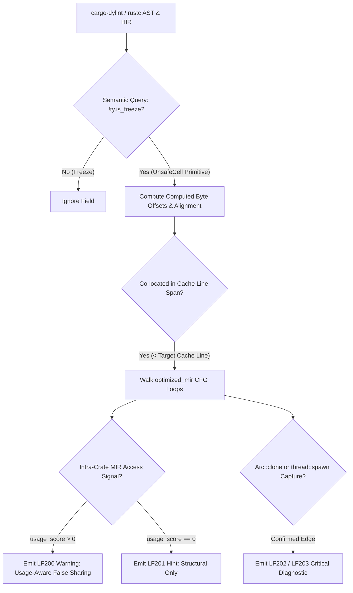

# 🦀 LineFault — Cache-Line False Sharing & Memory Ordering Static Analyzer

> **Static Analysis Engine for Rust Concurrent Type Layouts & Memory Orderings**

[](https://rust-lang.github.io/rustup/concepts/channels.html#nightly-channel)
[](https://github.com/trailofbits/dylint)
[](https://crates.io/crates/linefault)

LineFault is a zero-overhead static analysis tool built on `cargo-dylint` and `rustc` compiler internals. It analyzes computed byte offsets, field alignments, and HIR/MIR access paths in concurrent Rust data structures to detect cache-line false sharing hazards and over-strong atomic memory orderings.

---

## 🏎️ Core Technical Problem

### 1. False Sharing (Cache Thrashing)
When two independently mutated concurrent fields (e.g., `AtomicUsize` or an `Atomic` beside a `Mutex`) reside within the same CPU cache line, mutating one invalidates the cache line across CPU cores. LineFault calculates **post-compilation byte offsets**, accounting for Rust's default `repr(Rust)` field repacking, to identify co-located concurrent fields.

### 2. Over-Strong Atomic Memory Orderings
`Ordering::SeqCst` emits full memory barriers (`lock; mfence` on x86_64 ~30–88 cycles depending on microarchitecture). LineFault inspects HIR atomic callsites to flag candidates where weaker orderings (`Acquire`/`Release`/`Relaxed`) suffice based on syntax evidence.

---

## 🔬 Architectural Capabilities

| Feature | Technical Implementation |
|---|---|
| **Architecture-Aware Cache Lines** | Rules derived per target: 128B (`x86_64`, `aarch64`), 32B (`arm`, `mips`), 256B (`s390x`), 64B default. |
| **Semantic Concurrency Query** | Queries `rustc` typing environment (`!ty.is_freeze`) to detect internal `UnsafeCell` primitives regardless of wrapper type. |
| **MIR Field Usage Analysis (LF200)** | Walks `optimized_mir()` using dominator-tree CFG back-edge analysis to score field access frequencies inside loops and hot paths. |
| **Cross-Thread Tracking (LF202/LF203)** | Traces `Arc::clone` calls and closure captures across `thread::spawn`, `tokio::spawn`, and `std::thread::scope` boundaries. |
| **Soundness Guards** | Flags `#[repr(packed)]` structs containing atomics (`Deny` by default). Detects store-load / SeqCst-fence protocols to prevent unsafe downgrades. |

### ⚡ Static Analysis Compiler Pipeline



### 💡 Code Comparison Examples

#### False Sharing Hazard & Remediation
```rust
// ❌ BAD: Co-located atomics share 128-byte cache line (False Sharing Thrashing)
struct WorkerStats {
    reads: AtomicUsize,  // Offset 0
    writes: AtomicUsize, // Offset 8 (Clustered < 128B)
}

// ✅ GOOD: Explicit cache padding isolates hot fields into independent cache lines
use crossbeam_utils::CachePadded;

struct WorkerStats {
    reads: CachePadded<AtomicUsize>,  // Dedicated 128-byte cache line
    writes: CachePadded<AtomicUsize>, // Dedicated 128-byte cache line
}
```

---

## 🛠️ Warning Codes & Diagnostic Matrix

| Code | Type | Description |
|---|---|---|
| **LF100** | Memory Ordering | Flags `SeqCst` loads/stores/CAS where `Acquire`/`Release` or `AcqRel` syntax patterns exist. |
| **LF101** | Discarded Counter | Detects discarded `fetch_add`/`fetch_sub` return values, suggesting `Ordering::Relaxed`. |
| **LF102** | Fence Audit | Identifies explicit `atomic::fence(SeqCst)` calls requiring architectural review. |
| **LF200** | Usage-Aware False Sharing | Surfaced when structural layout risk is confirmed by intra-crate MIR access signals (`usage_score > 0`). |
| **LF201** | Structural Hint | Low-confidence structural risk without intra-crate MIR access evidence (`Allow` by default). |
| **LF202** | Confirmed Arc+Spawn | Critical false sharing warning triggered when a risky struct moves across thread spawn boundaries via `Arc`. |
| **LF203** | Confirmed Scoped Spawn | High-severity false sharing warning for reference captures in `thread::scope` closures. |

---

## 📊 Benchmark & Real-World Validation

Tested against standard Rust concurrent libraries on `nightly-2026-04-16` with zero compiler ICEs:

| Target Crate | Version | Warns | LF200 | LF201 | Ordering (LF10x) | Compiler ICEs | Result |
|---|---|---|---|---|---|---|---|
| `tokio` | 1.52.3 | 120 | 10 | 17 | 54 | 0 | ⚡ PASS |
| `crossbeam` | 0.8.4 | 124 | 3 | 7 | 102 | 0 | ⚡ PASS |
| `warp` | workspace | 53 | 6 | 12 | 15 | 0 | ⚡ PASS |
| `rayon` | 1.12.0 | 26 | 3 | 2 | 11 | 0 | ⚡ PASS |
| `parking_lot` | 0.12.5 | 0 | 0 | 0 | 0 | 0 | ⚡ PASS (Silent) |
| `dashmap` | 7.0.0-rc2 | 0 | 0 | 0 | 0 | 0 | ⚡ PASS (Silent) |
| `hashbrown` | 0.17.1 | 0 | 0 | 0 | 0 | 0 | ⚡ PASS (Silent) |

---

## 🚀 Execution & Integration

```bash
# Install toolchain prerequisites
cargo install cargo-dylint dylint-link

# Build LineFault dynamic library
git clone https://github.com/ddsha441981/linefault.git
cd linefault && cargo build --release

# Run linter against target repository
DYLINT_LIBRARY_PATH=../linefault/target/release cargo dylint --lib linefault
```

---

## 📜 License

Dual-licensed under MIT OR Apache-2.0.
