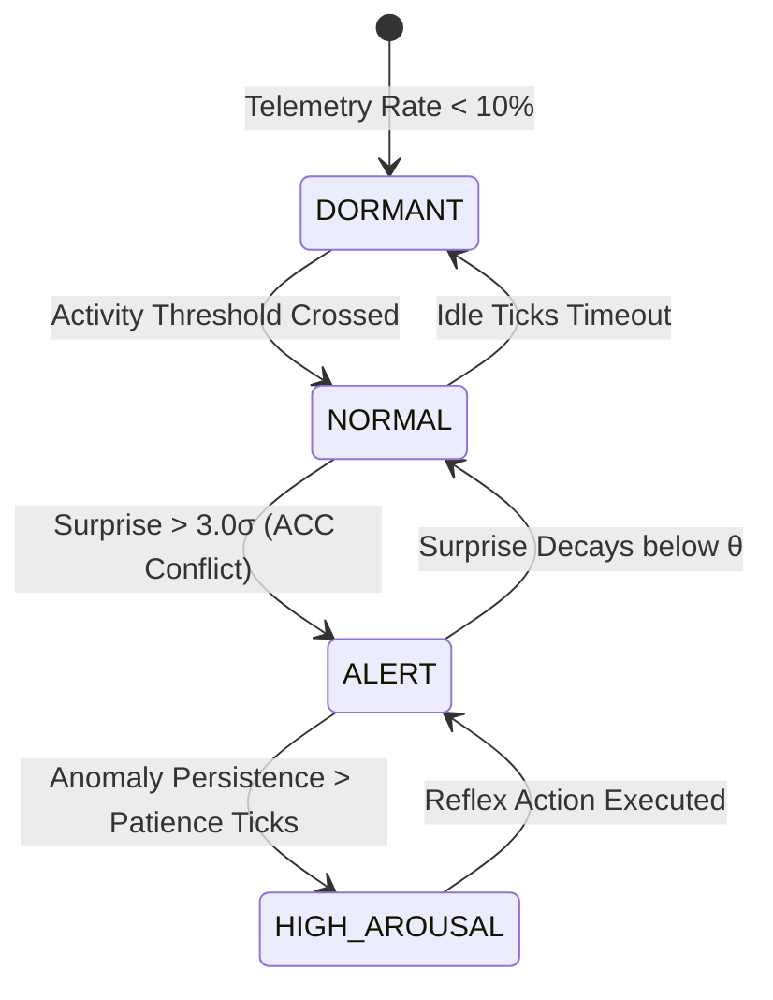

# 🧠 Project Lethe — Bio-Inspired Continual Learning Edge Engine

> **Sub-Microsecond Anomaly Detection & Self-Calibrating 12-Module Neurological Architecture**

[](https://github.com/ddsha441981)
[](https://www.rust-lang.org)
[](https://zenodo.org/records/20426838)
[%20Bounded-purple.svg)](#)

Project Lethe is a bio-inspired cognitive intelligence engine written in Rust that processes high-throughput telemetry streams at nanosecond speeds. Operating as an autonomous sensory firewall, it evaluates incoming data points to determine whether to retain novel vectors or discard routine patterns without maintaining unbounded raw historical logs.

---

## 🏗️ 12-Module Neurological Brain Architecture

```
[CPU] [Disk] [Net] [Temp] [Stock] [Log]
         ↓ 6-Sensor Universal Orchestrator
    ┌─────────────────────────────────────┐
    │   THALAMUS — Attention Routing      │
    │   Cross-sensor correlation weights  │
    └──────────────┬──────────────────────┘
                   ↓
    ┌─────────────────────────────────────┐
    │   ACC — Joint Anomaly Model         │
    │   4D multi-sensor covariance model  │
    └──────────────┬──────────────────────┘
                   ↓
    ┌─────────────────────────────────────┐
    │   RAS — Arousal State Machine       │
    │   Dormant → Normal → Alert → High   │
    └──────────────┬──────────────────────┘
                   ↓
    ┌──────────────────┐  ┌──────────────────────┐
    │   CEREBELLUM     │  │   BASAL GANGLIA      │
    │   Trend Predict  │  │   Routine Suppression│
    └────────┬─────────┘  └──────────┬───────────┘
             └──────────┬────────────┘
                        ↓
               [DECISION ENGINE]
```

### Module Breakdown

| Module | Functional Role | Algorithmic Mechanism |
|---|---|---|
| **Sensory Filter** | Primary Sensory Cortex | Diagonal Mahalanobis distance & Welford EMA gating |
| **Episodic Buffer** | Hippocampus | Short-term temporal anomaly buffer |
| **Sleep Engine / LTM** | Neocortex | Concept clustering, rule consolidation & active decay |
| **Associative Cortex** | Cerebral Cortex | Hebbian predictive concept graph |
| **Amygdala** | Amygdala | Instant reflex bypass for immediate threat vectors |
| **Prefrontal Cortex** | Prefrontal Cortex | Operational safety gating |
| **Circadian Rhythm** | Suprachiasmatic Nucleus | Time-of-day statistical sensitivity modulation |
| **RAS** | Reticular Activating System | 4-state arousal state machine (Dormant → Normal → Alert → High) |
| **ACC** | Anterior Cingulate Cortex | 4D joint multi-sensor covariance conflict model |
| **Thalamus** | Thalamus | Cross-sensor correlation attention routing |
| **Cerebellum** | Cerebellum | Hybrid OLS + EWMA real-time trend prediction |
| **Basal Ganglia** | Basal Ganglia | Habit memory & false-alarm suppression |

### ⚡ RAS Arousal State Machine Flow



---

## 🔬 Mathematical Formulations

### 1. Welford Online EMA Gating
Mean ($\mu$) and M2 variance parameters are updated in $O(1)$ without keeping past raw samples:
$$\delta_k = x_k - \mu_{k-1}$$
$$\mu_k = \mu_{k-1} + \frac{\delta_k}{k}$$
$$M_{2,k} = M_{2,k-1} + \delta_k(x_k - \mu_k)$$

### 2. Diagonal Mahalanobis Distance (Surprise Metric)
Given normalized input vector $X = [x_1, \dots, x_d]^T$ and standard deviation vector $\sigma$:
$$D_{\text{Mahalanobis}}(X, \mu) = \sqrt{\sum_{i=1}^{d} \left(\frac{x_i - \mu_i}{\sigma_i}\right)^2}$$

### 3. Exponential Synaptic Decay
Concept weight $W(t)$ decays dynamically per tick unless reinforced:
$$W(t + \Delta t) = W(t) \cdot e^{-\lambda \cdot \Delta t}$$
Where $\lambda$ represents the active forgetting constant. When $W(t) < W_{\text{prune}}$, the concept is garbage collected.

---

## ⚡ Performance Specs (v4.2.0)

| Metric | Measured Value |
|---|---|
| **Sensory Filter Throughput** | **4.07 Million vectors/sec** |
| **Full Cognitive Processing** | **0.10 Million vectors/sec** |
| **Anomaly Compression** | 6,460 raw anomalies → 29 universal concepts |
| **Memory Model** | $O(1)$ per dimension, strictly bounded |
| **Compute Complexity** | $O(D)$ per vector |
| **Telemetry Audit Trail** | 20-column per-tick cognitive audit log |

---

## 💾 Persistence State Architecture

All operational brain states serialize deterministically to the local `memory/` storage layer:

- `memory/rules.bin`: Active LTM concepts.
- `memory/subconscious.bin`: Subconscious vault (immortal concept storage).
- `memory/cortex.bin`: Hebbian associative graph matrix.
- `memory/habits.bin`: Basal Ganglia habit suppression matrix.
- `memory/acc_model.bin`: ACC 4D covariance matrix.
- `memory/thalamus_corr.bin`: Thalamus cross-sensor correlation weights.
- `memory/rl_patience.bin`: Autonomous RL patience parameters.

---

## 📄 Academic Publication & DOI

**"Project Lethe: Bio-Inspired Autonomous Edge Intelligence via Sub-Microsecond Continual Learning and Active Forgetting"**  
*Deendayal Kumawat (2026)* — Zenodo. [DOI: 10.5281/zenodo.20531995](https://doi.org/10.5281/zenodo.20531995)

---

## ⚖️ Licensing

Dual-licensed under **GPL-3.0** for open-source research and **Commercial License** for enterprise edge deployments.
